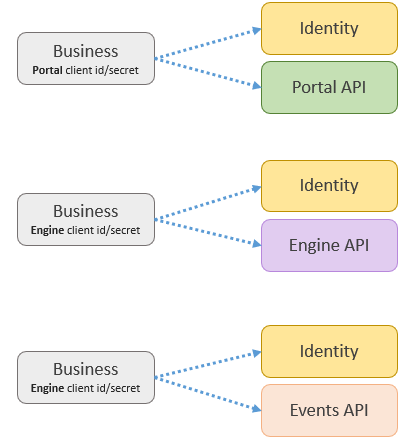

.. _ref_api_overview:

Overview
========

This section will provide guidance and usage on how to interact with Hubster’s APIs. The goal of Hubster is to provide a consistent and systematic approach across all our API resources, in terms of style, format and responses. 

Hubster’s APIs are designed using **REST** principles and most of our payloads are structured using **JSON**. Any exception to this rule will be noted where necessary.

.. note:: Hubster APIs incorporate cross-origin resource sharing (**CORS**) whereby facilitating web applications to freely use our API in an authenticated and secure manner.

Environments
^^^^^^^^^^^^

Below are the list of Hubster environments:

.. list-table::
    :widths: 5 50
    :header-rows: 1

    * - Identity
      - API Resource
    * - Demo
      - https://demo-identity.hubster.io        
    * - Production
      - https://identity.hubster.io        
      

.. list-table::
    :widths: 5 50
    :header-rows: 1

    * - Portal 
      - API Resource
    * - Demo
      - https://demo-portal-api.hubster.io        
    * - Production
      - https://portal-api.hubster.io        
    

.. list-table::
    :widths: 5 50
    :header-rows: 1

    * - Engine
      - API Resource
    * - Demo
      - https://demo-engine.hubster.io        
    * - Production
      - https://engine.hubster.io        

.. list-table::
    :widths: 5 50
    :header-rows: 1

    * - Events
      - API Resource
    * - Demo
      - https://demo-events.hubster.io        
    * - Production
      - https://events.hubster.io        

Identity to API Resource Interaction 
^^^^^^^^^^^^^^^^^^^^^^^^^^^^^^^^^^^^

Below are depictions of how a business application first interacts with Hubster’s identity service obtain an **access token**, 
later to be used to access Hubster’s respective API resources - Portal, Engine and Events.

.. note:: 
    API access tokens use the **client_credentials** grant type, meaning that you can only obtain a token using a **client_id** and **client_secret** respectively.    
    These tokens are longed-lived and lasts no longer than 30 days. Once a token has expired, accessing an API resource will yield a HTTP Status **401** - Unauthorized Access. 

    Furthermore, access tokens are only meant for their indented API resource. For example, if a business obtains an access token for the Portal API resource, 
    it cannot be used for the Engine API resource and likewise. These was intentional as their scopes of each API resource are vastly different in nature and 
    provides a more secure environment. *There's an exception to this rule. Accessing the Events API requires an Engine access token.*

Standard Error Response
^^^^^^^^^^^^^^^^^^^^^^^

Hubster's standard error response model is consistent across all API resources. 
The only difference being are the actual :ref:`error codes<ref_api_error_codes>` returned by each API resource. 

Below is an example of a **Bad Request** (400) returned by the Portal API. 

**Response**

.. code-block:: JSON

    {
        "status": 400,
        "errors": [
            {
                "code": 301,
                "description": "Property 'name' is required. (code: PRT000301)"
            },
            {
                "code": 206,
                "description": "Value '50000 'for parameter type 'statusId' is not supported. (code: PRT000206)"
            }
        ]
    }

.. list-table::
    :widths: 5 50
    :header-rows: 1   

    * - Property
      - Meaning
    * - status
      - The :ref:`HTTP Status code<ref_api_status_codes>`. This will value always equals header's HTTP Status code.
    * - errors
      - The list of :ref:`errors<ref_api_error_codes>`.
   

Paginated Results 
^^^^^^^^^^^^^^^^^

In some cases, Hubster may return a **paginated** response whereby, the business will need to re-query the next result, 
based on **page number** and **page size**. This is typically when certain **GET** requests may yield 
a large number of records. 

Below is an example returning the Hubs from the Portal API resource.

**Response** : 200 (OK)

.. code-block:: JSON

    {
        "pageNumber": 0,
        "pageSize": 50,
        "total": 2,
        "results": [
            {
                "hubId": "00000000-0000-0000-0000-0000000000a2",
                "tenantId": "00000000-0000-0000-0000-000000000001",
                "name": "Dev Hub 1",
                "description": "Dev Hub 1 (Websocket)",
                "statusId": 2000
            },
            {
                "hubId": "00000000-0000-0000-0000-0000000000a3",
                "tenantId": "00000000-0000-0000-0000-000000000001",
                "name": "Hubster Demo (blank)",
                "description": "Hubster Demo mainly used for Videos",
                "statusId": 2000
            }
        ]
    }

.. list-table::
    :widths: 10 80
    :header-rows: 1   

    * - Property
      - Meaning
    * - pageNumber
      - The requested page number.
    * - pageSize
      - The requested page size.
    * - total
      - | The total number of results across all pages. 
        | **Note**: the total number of items does not necessary equal the number of result items.            
    * - results
      - | A list of response models returned by the API resource.
        | **Note**: the result models may differ on per call basis.

.. _ref_api_status_codes:

HTTP Status Codes
^^^^^^^^^^^^^^^^^

Ever Hubster API related service will return one of the following standard HTTP Status codes.

.. list-table::
    :widths: 5 50
    :header-rows: 1   

    * - HTTP Status
      - Meaning
    * - 200
      - OK response. The body of the response will include the data requested.
    * - 201
      - OK response. The response will content no data.
    * - 400
      - Bad request. The body of the response will have more info.
    * - 401
      - Unauthorized. Token is invalid.
    * - 403
      - Forbidden. Access to the requested resource is forbidden.
    * - 408
      - Timed out. The request timed out.
    * - 409
      - Conflict. The request caused a conflict.
    * - 410
      - Not available. The request is not available.
    * - 417
      - Expectation Failed. The operation was aborted.
    * - 429
      - Too many requests. API usage limit has been reached.
    * - 500
      - Internal server error. There was an internal issue with the service.
    * - 501
      - Not implemented. The request is not implemented.
    * - 503
      - Service unavailable. The service is unavailable.