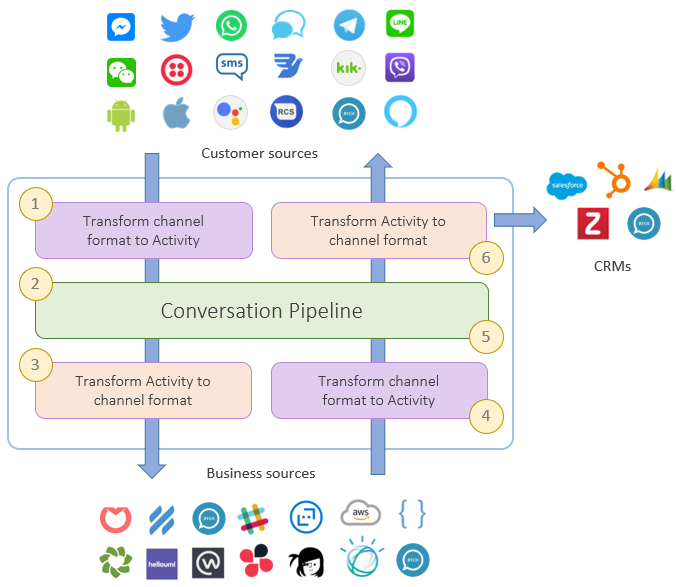

.. role:: underline
    :class: underline

.. _ref_activities:

Activities
==========

When integrating with disparate systems, data coming in or data going out, most likely come in 
various shapes and formats. In Hubster's case, most integrations may have similar functionalities, 
however, each integration on their own, have proprietary formats that differ from each other. 
Because of these numerous differences, it's important to generalize their formats into a common format that 
is agnostic and most of all consistent. At Hubster, we call this common format an **Activity**. 
This in essence, is the hallmark behind the concept of **unified messaging**.

This section will explain what an activity is, it's constituents and how it’s consumed by Hubster’s conversation pipeline. 
See the depiction below for annotated description on how Hubster transforms both in and outbound data models.

**How Hubster’s UX Multi-rendering/Response Framework (RRF) works:**

#. When data is sent by a specific integration type, the **inbound** RRF will transform this data into a Hubster activity for further consumption. 
#. The conversation pipeline can now freely work and amend the activity without any knowledge of its original source format.
#. Once the conversation pipeline completes its workflow, it will send the response to the **outbound** RRF which transforms 
   the activity to the appropriate integration type’s proprietary format.

Activity
^^^^^^^^

An activity is fairly simple structure that either contains an :ref:`Message Type<ref_activities_message_types>`  
or an :ref:`Action Type<ref_activities_action_types>`, but not both.

.. note:: 
    For sake of sample, both **message** and **action** nodes are shown. 
    However, these nodes are mutually exclusive and will never be presented together 
    in actuality.

.. code-block:: JSON

    {
        "type": "message|action",
        "eventTrigger": "message:customer",
        "eventId": 1603933721542,
        "externalId": "my-external-id",
        "isEcho": false,
        "interactionId": "00000000-0000-0000-0000-000000000005",
        "flowProcess": "Default",
        "sender": {
            "integrationId": "00000000-0000-0000-0000-000000000001",
            "integrationType": "Customer",
            "channelType": "Direct",
            "tokenId": "t+8qymYD1jp7wDSHG+3eUA=="
        },
        "recipient": {
            "integrationId": "00000000-0000-0000-0000-000000000006",
            "integrationType": "Agent",
            "channelType": "Direct",
            "tokenId": "971480cb-938c-4dfd-be4e-01756c833490.00000000-0000-0000-0000-000000000003"
        },
        "message": {
            "type": "text",
            "text": "Hi there!"			
        },
        "action": {
            "type": "payload",
            "payloadType": "hubster.transfer",
            "payload": {
                "url": "http://localhost:4200",
                "label": "Click here to be transferred",
                "mount": 1000,
                "force": false
            }
        }        
    }  

.. list-table::
    :widths: 5 50
    :header-rows: 1   
  
    * - Property
      - Description
    * - type
      - The is the type of activity being described. Can either be a **message** or **action**. 
    * - eventTrigger
      - The source of the trigger. Typically this is the **sender** of of the activity. See :ref:`Integration Types<ref_api_integration_types>` 
    * - eventId
      - The epoch UNIX time in milliseconds when this event was initiated. 
    * - externalId
      - A custom external id that can be sent by custom integrations. Typically, this value will be null.
    * - isEcho
      - A boolean state indicating wither the activity is an echo. Some custom integrations when sending an 
        activity may wish to receive a feedback activity. This is because when sending an activity, the sender
        tends to send minimal data. Having echo enabled, the sender will receive a more enriched payload 
        with additional data that can be important to the sender. For example, if the sender sends a 
        youtube link in the message text, Hubster will convert the activity to youtube 
        :ref:`message type<ref_activities_message_types>` instead.
    * - interactionId
      - The interaction id for this activity. This only applies to **message** types.
    * - flowProcess
      - The pipeline flow that was taken. The current values are **Default** or **AutoReplay**.
    * - sender
      - The sender :ref:`source<ref_activities_sources>` of this activity.
    * - recipient
      - The recipient (receiver) :ref:`source<ref_activities_sources>` of this activity.
    * - message
      - If the *activity.type* is **message** then this value will is set. 
        See :ref:`message type<ref_activities_message_types>` for more details
    * - action
      - If the *activity.type* is **action** then tis value will is set. 
        See :ref:`action type<ref_activities_action_types>` for more details

.. _ref_activities_sources:

Activity Source
^^^^^^^^^^^^^^^

An activity will always contain a **sender** node who sent the activity, and a **recipient** node who will be receiving the activity. 
The properties are identical but the values and the node name, indicates details of the sending and receiving parties.

.. code-block:: JSON

    {
        "sender": {
            "integrationId": "00000000-0000-0000-0000-000000000001",
            "integrationType": "Customer",
            "channelType": "Direct",
            "tokenId": "t+8qymYD1jp7wDSHG+3eUA=="
        },
        "recipient": {
            "integrationId": "00000000-0000-0000-0000-000000000006",
            "integrationType": "Agent",
            "channelType": "Direct",
            "tokenId": "971480cb-938c-4dfd-be4e-01756c833490.00000000-0000-0000-0000-000000000003"
        }
    }  

.. list-table::
    :widths: 5 50
    :header-rows: 1   
  
    * - Property
      - Description
    * - integrationId
      - The integration id of the source.
    * - integrationType
      - The :ref:`integration type<ref_api_integration_types>` of the source.
    * - channelType
      - The :ref:`channel type<ref_api_channel_types>` of the source.
    * - tokenId
      - Reserved for Hubster.

.. _ref_activities_message_types:

Message Types
^^^^^^^^^^^^^

An activity **message** supports the following **types**. Messages are an activity's first-class-citizen 
as they make up the majority of events being sent and received between integrations.

Text
~~~~

Sources allowed to send: **customer**, **agent** and **bot**.

.. list-table::
    :widths: 5 10 50
    :header-rows: 1   
  
    * - Property     
      - Mandatory
      - Description
    * - type
      - Yes
      - Must be **text**.
    * - text
      - See **note**
      - | The text message to send.
           
        | Links such as **Image**, **Youtube**, **Vimeo**, **Video**, **Audio** or **location**, may convert this message type to it's property message equivalent 
          if no additional text was provided. If additional text was provided, then Hubster will add a message equivalent, such as **Youtube**, for example
          to the items array.
    * - items
      - See **note**
      - | A list of items containing zero or more of the following **messages types**:
        
        * youtube 
        * vimeo
        * video 
        * audio
        * image
        * attachment
        * location
        * contact
        * card
    * - actions
      - See **note**
      - | A list of actions containing zero or more of the following **action types**:      

        * postback
        * reply
        * link        

.. note:: 
    The **text message** type must provide one or more of the following **mandatory** values:
    
    * text
    * items
    * actions

**Examples**

.. list-table::
    :widths: 10 200
    :header-rows: 1   

    * - Request          
      - View
    * - .. code-block:: JSON

          {
            "type": "text",								
            "text": "Hello there, how can I help you?"
          }  

      - .. image:: images/activity_text_ex_01.png

    * - .. code-block:: JSON

          {
            "type": "text",
            "text": "Here's my contact info",
            "items": [
              {
                "type": "contact",
                "imageUrl": "https://site.com/eva.png",
                "title": "Eva Green",
                "subtitle": "Mighty Health",
                "properties": [
                  { 
                    "key": "Title",
                    "value": "Mighty Health"
                  },
                  {
                    "key": "Address",
                    "value": "123 Main Street, Maple, ON",
                    "type": "address;work"
                  },
                  {
                    "key": "Cell",
                    "value": "(416) 555-0001",
                    "type": "phone;cell"
                  },
                  {
                    "key": "Email",
                    "value": "eva@mightyhealth.com",
                    "type": "email"
                  }
                ],
                "channels": [
                  {
                    "type": "Webchat",
                    "metadata": [
                      {
                        "key": "caption-show",
                        "value": "true"
                      },
                      {
                        "key": "caption-color",
                        "value": "white"
                      }
                    ]
                  }
                ]
              }
            ]
          }          

      - .. image:: images/activity_text_ex_02.png            

    * - .. code-block:: JSON

          {
            "type": "text",
            "text": "Select one of the following options",
            "actions": [
              {
                "type": "postback",
                "title": "Yes",
                "payload": "Yes",
                "channels": [
                  {
                    "type": "Webchat",
                    "metadata": [
                      {
                        "key": "type",
                        "value": "primary"
                      }
                    ]
                  }
                ]
              },
              {
                "type": "postback",
                "title": "Maybe",
                "payload": "Maybe",
                "channels": [
                  {
                    "type": "Webchat",
                    "metadata": [
                      {
                        "key": "type",
                        "value": "danger"
                      }
                    ]
                  }
                ]
              },
              {
                "type": "reply",
                "title": "No",
                "payload": "No",
                "channels": [
                  {
                    "type": "Webchat",
                    "metadata": [
                      {
                        "key": "type",
                        "value": "success"
                      }
                    ]
                  }
                ]
              },
              {
                "type": "link",
                "title": "hubster",
                "url": "https://hubster.io",
                "channels": [
                  {
                    "type": "Webchat",
                    "metadata": [
                      {
                        "key": "type",
                        "value": "info"
                      }
                    ]
                  }
                ]
              }
            ]
          }

      - .. image:: images/activity_text_ex_03.png          

Youtube             
~~~~~~~

Sources allowed to send: **customer**, **agent** and **bot**.

.. list-table::
    :widths: 5 10 50
    :header-rows: 1   
  
    * - Property     
      - Mandatory
      - Description
    * - type
      - Yes
      - Must be **youtube**.
    * - url
      - Yes
      - | The youtube url, which can be in anyone of the following formats:
        
        * `https://youtube.com/embed/x1245b` (preferred)
        * `https://youtube.com/watch?v=x1245b`
        * `https://m.youtube.com/watch?v=x1245b`
        * `https://youtu.be/watch?v=x1245b`     
        

**Example**

.. list-table::
    :widths: 10 200
    :header-rows: 1   

    * - Request          
      - View
    * - .. code-block:: JSON

          {
            "type": "youtube",								
            "url": "https://youtube.com/watch?v=x1245b"
          }  

      - .. image:: images/activity_youtube_ex_01.png

Vimeo      
~~~~~

Sources allowed to send: **customer**, **agent** and **bot**.

.. list-table::
    :widths: 5 10 50
    :header-rows: 1   
  
    * - Property     
      - Mandatory
      - Description
    * - type
      - Yes
      - Must be **vimeo**.
    * - url
      - Yes
      - | The Vimeo url, which can be in anyone of the following formats:
        
        * `https://player.vimeo.com/video/12345678` (preferred)
        * `https://vimeo.com/12345678`
        

**Example**

.. list-table::
    :widths: 10 200
    :header-rows: 1   

    * - Request          
      - View
    * - .. code-block:: JSON

          {
            "type": "vimeo",								
            "url": "player.vimeo.com/video/12345678"
          }  

      - .. image:: images/activity_vimeo_ex_01.png

Video         
~~~~~

Sources allowed to send: **customer**, **agent** and **bot**.

.. list-table::
    :widths: 5 10 50
    :header-rows: 1   
  
    * - Property     
      - Mandatory
      - Description
    * - type
      - Yes
      - Must be **video**.
    * - url
      - Yes
      - | The video url, which can be in anyone of the following formats:
        
        * `.mp4` (preferred)
        * `.mov`
    * - label
      - No
      - | The label of this audio. Think of the label as a title to be displayed.
        | **Note**: label is channel specific and may not render on certain channels.
    * - mimeType
      - No
      - The mime type of the video. Hubster will try it's best to determine the mime type 
        based on the **url**.

**Example**

.. list-table::
    :widths: 10 200
    :header-rows: 1   

    * - Request          
      - View
    * - .. code-block:: JSON

          {
            "type": "video",
            "url": "http://site.com/myvideo.mp4"
          }  

      - .. image:: images/activity_video_ex_01.png

Audio      
~~~~~

Sources allowed to send: **customer**, **agent** and **bot**.

.. list-table::
    :widths: 5 10 50
    :header-rows: 1   
  
    * - Property     
      - Mandatory
      - Description
    * - type
      - Yes
      - Must be **audio**.
    * - url
      - Yes
      - | The audio url, which can be in anyone of the following formats:
        
        * `.mp3` (preferred)
        * `.mp4`
        * `.wav`
    * - label
      - No
      - | The label of this audio. Think of the label as a title to be displayed.
        | **Note**: label is channel specific and may not render on certain channels.
    * - mimeType
      - No
      - The mime type of this audio. Hubster will try it's best to determine the mime type 
        based on the **url**.
    
**Example**

.. list-table::
    :widths: 10 200
    :header-rows: 1   

    * - Request          
      - View
    * - .. code-block:: JSON

          {
            "type": "audio",
            "url": "http://site.com/myaudio.mp3"
          }  

      - .. image:: images/activity_audio_ex_01.png

Image      
~~~~~

Sources allowed to send: **customer**, **agent** and **bot**.

.. list-table::
    :widths: 5 10 50
    :header-rows: 1   
  
    * - Property     
      - Mandatory
      - Description
    * - type
      - Yes
      - Must be **image**.
    * - url
      - Yes
      - The image url.
    * - urlAnchor
      - No
      - The url anchor. Used when user clicks on image.
    * - alt
      - No
      - The alternate text for this image.
    * - title
      - No
      - | The text to show on the image.         
        | **Note**: title is channel specific and may not render on certain channels.
    * - channels
      - No
      - Channel specific applied properties. The example below shows how to render 
        the title on a **Webchat** channel.

**Example**

.. list-table::
    :widths: 10 200
    :header-rows: 1   

    * - Request          
      - View
    * - .. code-block:: JSON

          {
            "type": "image",
            "url": "http://site.com/myimage.png",
            "alt": "Some alternate text",
            "title": "Eva Green",
            "channels": [{
                "type": "Webchat",
                "metadata": [
                    { 
                      "key": "caption-show", 
                      "value": "true" 
                    },
                    { 
                      "key": "caption-color", 
                      "value": "white" 
                    }
                ]
            }]
          }  

      - .. image:: images/activity_image_ex_01.png

Attachment      
~~~~~~~~~~

Sources allowed to send: **customer**, **agent** and **bot**.

.. list-table::
    :widths: 5 10 50
    :header-rows: 1   
  
    * - Property     
      - Mandatory
      - Description
    * - type
      - Yes
      - Must be **attachment**.
    * - label
      - Yes
      - The label for this attachment.
    * - mimeType
      - Yes
      - The mime type for this attachment i.e pdf, etc.
    * - url
      - Yes
      - The attachment url.
    
**Example**

.. list-table::
    :widths: 10 200
    :header-rows: 1   

    * - Request          
      - View
    * - .. code-block:: JSON

          {
            "type": "attachment",
            "label": "Year end report",
            "mimeType": "pdf",
            "url": "http://site.com/myfile.pdf"
          }  

      - .. image:: images/activity_attachment_ex_01.png

Location          
~~~~~~~~

Contact
~~~~~~~

Card       
~~~~

Carousel         
~~~~~~~~

List
~~~~

Command
~~~~~~~
    

.. public const string Link = "link";
.. public const string Postback = "postback";
.. public const string Reply = "reply";

.. _ref_activities_action_types:

Action Types
^^^^^^^^^^^^

TODO

.. public const string Seen = "seen";
.. public const string TypingOn = "typing_on";
.. public const string TypingOff = "typing_off";
.. public const string Payload = "payload";
