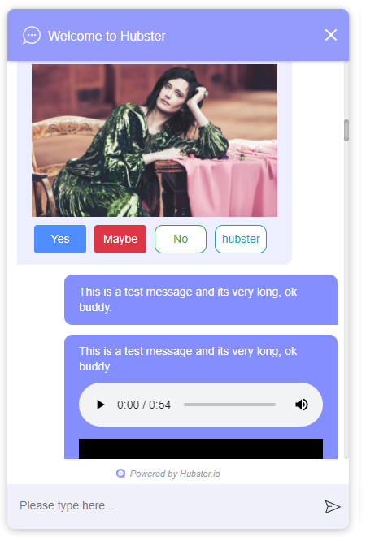
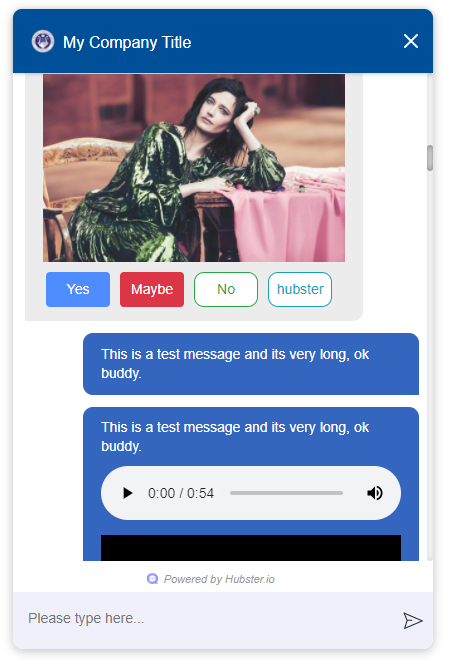

.. role:: underline
    :class: underline

Webchat Component
=================

This section will describe how to embed and configure the Hubster Webchat component 
onto your website. Different configuration examples will be provided and a detail
explanation describing each configuration property available.

Adding to Website
*****************

When working with Hubster's Webchat component, you must first embed the component onto every webpage
where web-chatting is desired on your website.

Below is a snippet of the default configuration to enable web-chatting on your webpage. 
It should be noted that it's best to add the webchat component at the very tail end of 
the HTML webpage. 

.. code-block:: HTML

    <!DOCTYPE html>
    <html  lang="en">
    <head>
        ...
    </head>
    <body>
        ...

        <!-- Webchat script -->
        <hubster-webchat></hubster-webchat>
        
        
    </body>    
    </html>

By default, the webchat component will look like this:

**Configuring the look-and-feel**

Although, Hubster loves the default look, we realize our customers need the ability to change how
the webchat component looks-and-feels on their website. A lot of consideration and flexible has been provided, 
giving customers a wide range of style settings to configure their webchat component.

Below is an example configuration on how one would style the component using a blue theme.

.. code-block:: HTML

    <!DOCTYPE html>
    <html  lang="en">
    <head>
        ...
    </head>
    <body>
        ...

        <!-- Webchat script -->
        <hubster-webchat></hubster-webchat>
        
        
    </body>    
    </html>

The above configuration yields the following theme.

.. note::
    Before going live, it's best to **style** the webchat component first to suite your site's look-and-feel. 
    This however, can be a time consuming task, but luckily Hubster makes this easy. 
    
    Hubster provides configuration property called **styling** (see the example above). 
    By default, this property is set to **false**. However, by setting this property to **true**, Hubster will 
    provide a list of all the available webchat widgets for you to style. Most widgets share the same styling property, 
    meaning that, if you change one style, it may affect one or more other widgets. 
    
    Hubster provides a wide range of styles that can be change, however, try to avoid changing styles that may affect
    sizes and position as we may not guarantee the visual behavior. 

    Furthermore, when **styling** is set to **true**, the webchat component disables all backend communications 
    with Hubster services.

Configuration
*************
    
.. list-table::
    :widths: 5 10 50
    :header-rows: 1

    * - Property
      - Mandatory
      - Comments
    * - engineEndpoint
      - No
      - | When developing in demo mode, set this value to 
        | https://demo-engine.hubster.io
        | 
        | The default is: https://engine.hubster.io (production)
    * - eventsEndpoint
      - No
      - | When developing in demo mode, set this value to: 
        | https://demo-events.hubster.io
        | 
        | The default is: https://events.hubster.io (production)
    * - sessionTTL 
      - No
      - How long the user's conversation should last in mins. The user's conversion is 
        maintain even after they close their browser. If the user does not visit the 
        site after the sessionTLL has expired, a new conversation will be established.
        Sessions are based on a rolling window, meaning that the session's start time
        will reset if the user revisits the site prior to the session expiring.
        The default is 1440 (1 day).
    * - integrationId
      - Yes
      - The integration id for this Webchat integration. 
    * - openOnNewMessage
      - No
      - This tells the webchat component when closed, to open the chat window if 
        a new message immediately arrives. The default is false.
    * - styling
      - No
      - Set this value to true when styling the webchat component. The webchat 
        will provide a list of all the available webchat widgets for you to style. The default is false.
    * - styles
      - No
      - A collection of styles. See the :ref:`Styles Configuration<ref_styles_config>` section.
    * - mountOnLoad
      - No
      - A **JavaScript** method that will be invoked when the webchat component 
        is first loaded on the host webpage. This method when provided, allows
        the developer to determine how long of a **delay** (in milliseconds) the 
        webchat component should wait before **mounting** (open).
        
        |
        | :underline:`On page reload`          
        | -- a return value < 0 indicates no mounting should occur
        | -- a return value >= 0 indicates mount after number of milliseconds
        
        *mountOnLoad(): number;*

    * - onMount
      - No
      - A **JavaScript** method that will be invoked when the webchat component 
        has been mounted (open) or docked (closed).
        
        |
        | *onMount(mounted: boolean): void;*

    * - onReceivedActivity
      - No
      - A **JavaScript** method that will be invoked when the webchat component 
        receives an :ref:`activity<ref_activities>` from the Hubster Engine service before it's displayed 
        on the webchat list.

        |
        | *onReceivedActivity(activity: Activity): void;*
    * - onBeforeActivitySend
      - No
      - A **JavaScript** method that will be invoked when the webchat component is 
        about to send a user :ref:`activity<ref_activities>` to Hubster's Engine service. The programer 
        has the option to inspect the activity and perform any action as deemed
        necessary.
        
        |
        | Return **true** to allow the user activity to be sent, otherwise **false** to ignore it.
        |
        | *onBeforeActivitySend(activity: Activity): boolean;*

        .. note:: 
            | Typically this event is used when the user presses a **postback** button event. The **payload** of the postback may contain a special action that  programer can then inspect and preform a local action on the browser.

    * - onConversation
      - No
      - A **JavaScript** method that will be invoked when the webchat component
        is about to **establish a conversation**. The developer has the option to 
        provide a unique binding key (typically a user id) and other properties,
        such as the user's name, etc.
        
        |
        | *onConversation(): EstablishConversation;*

        .. code-block:: JAVASCRIPT            

            {
                "bindingKey": "some_unique_userId",
                "properties": {
                    "profile": {
                        "full name": "SomeUserName",
                        "gender": "female",
                        "prop1": "value1",
                        "prop2": "value2"                        
                    },
                    "additional": {
                        "prop1": "value1",
                        "prop2": "value2"                        
                    }
                }                
            }

        .. note::
            | Typically this method is used if the web app hosting the webchat component, knows some thing about the logged user. The web app can provide a unique value for the **bindingKey**, typically the user Id and at minimum, provide the user's name in the **properties.profile."full name"** property.

.. _ref_styles_config:

**Styles Configuration**

Hubster wanted to provide an easy, consistent and standard way styling your webchat component.
Hubster decided to adhered to the **HTML** *style* property format as shown below.

.. code-block:: HTML

    
...

The only stipulation is that any style property that is normally **hyphenated**, will be replace with 
its **camelCase** equivalent:
    
    * **text-decoration** will be represented as **'textDecoration'**
    * **z-index** will be represented as **'zIndex'**
    * **background-color** will be represented as **'backgroundColor'**
    * **color** will be represented as **'color'** (in this example, the property name remains the same)
    * and so on...

See a more formal example below.

.. code-block:: JAVASCRIPT

    window.HUBSTER_CONFIG = {
        styles: {
            mount: {
                iconUrl: 'https://cdn.com/logo.png',
                style: {
                    'backgroundColor': '#004F99',
                    'bottom': '5rem',
                    'right': '.9rem',
                    'zIndex': '100'
                },
            },
            userTextMessage: {
                'backgroundColor': '#3566BF'
            },
        },
        ...
    };

.. note:: 
    Values for each style property must be incased in single **'quotes'**.
    This is true even for properties that accept numeric values.
    If values are not provided, the webchat component will assume its defaults.

.. list-table::
    :widths: 10 50
    :header-rows: 1

    * - Style      
      - Comments
    * - chatBackgroundColor      
      - This style controls the background color for the webchat list view. Examples: '#ABDCEF' or 'red' ...
    * - userTextMessage      
      - | This style controls the **user text message** bubble. See example below:

        .. code-block:: JAVASCRIPT
            
            window.HUBSTER_CONFIG = {
               styles: {
                   userTextMessage: {
                       'color': 'green'
                       'backgroundColor': '#CFCFCF'
                   },
               },
               ...
            };

    * - agentTextMessage      
      - | This style controls the **agent text message** bubble. See example below:        

        .. code-block:: JAVASCRIPT
            
            window.HUBSTER_CONFIG = {
               styles: {
                   agentTextMessage: {
                       'color': 'blue'
                       'backgroundColor': 'white'
                   },
               },
               ...
            };

    * - botTextMessage      
      - | This style controls the **bot text message** bubble. See example below:        
         
        .. code-block:: JAVASCRIPT
            
            window.HUBSTER_CONFIG = {
               styles: {
                   botTextMessage: {
                       'color': 'yellow'
                       'backgroundColor': '#00FF00'
                   },
               },
               ...
            };

    * - header      
      - | This style controls the **header** of the webchat component. See example below:        
                
        .. code-block:: JAVASCRIPT
                
            window.HUBSTER_CONFIG = {
                styles: {
                    header: {
                        title: 'My Company Title',
                        iconUrl: 'https://cdn.com/logo.png',                    
                        style: {
                            'color': 'white'
                            'backgroundColor': 'blue'
                        }
                    }
                },
                ...
            };  

    * - footer      
      - | This style controls the **footer** of the webchat component. See example below:        
                
        .. code-block:: JAVASCRIPT
                
            window.HUBSTER_CONFIG = {
                styles: {
                    footer: {
                        maxInputHeight: '40px',
                        placeholderText: 'My text input placeholder...'
                    }
                },
                ...
            };  
        
    * - mount      
      - | This style controls the **mount** of the webchat component. See example below:        
                
        .. code-block:: JAVASCRIPT
                
            window.HUBSTER_CONFIG = {
                styles: {
                    mount: {
                        iconUrl: 'https://cdn.com/logo.png',
                        style: {
                            'backgroundColor': '#004F99',
                            'bottom': '5rem',
                            'right': '.9rem',
                            'z-index': '100'
                        }
                    }
                },
                ...
            };  
      
    * - buttons     
      - Hubster supports the following **Postback** buttons.
        
        .. image:: images/postback_buttons.png
                        
        | To change the look-and-feel, see the following configuration.

        
        .. code-block:: JAVASCRIPT
                
            window.HUBSTER_CONFIG = {
                styles: {                    
                    buttons: {
                        primary: {
                            'color': '#004F99',
                            'backgroundColor': '#004F99',
                            'borderColor': 'black'
                        },
                        primaryHover: {
                            'color': 'white',
                            'backgroundColor': 'green',
                            'borderColor': 'yellow'
                        },
                        info: {
                            'color': '#004F99',
                            'backgroundColor': '#004F99',
                            'borderColor': 'black'
                        },
                        infoHover: {
                            'color': 'white',
                            'backgroundColor': 'green',
                            'borderColor': 'yellow'
                        },
                        // see above properties for examples
                        secondary: { ... },
                        secondaryHover: { ... },
                        success: { ... },
                        successHover: { ... },
                        warning: { ... },
                        warningHover: { ... },
                        danger: { ... },
                        dangerHover: { ... },
                    }                    
                },
                ...
            };  

    * - quickReplies      
      - Hubster supports the following **Quick Reply** buttons.
        
        .. image:: images/quick_reply_buttons.png
                        
        | To change the look-and-feel, see the following configuration.

        
        .. code-block:: JAVASCRIPT
                
            window.HUBSTER_CONFIG = {
                styles: {                    
                    quickReplies: {
                        primary: {
                            'color': '#004F99',
                            'backgroundColor': '#004F99',
                            'borderColor': 'black'
                        },
                        primaryHover: {
                            'color': 'white',
                            'backgroundColor': 'green',
                            'borderColor': 'yellow'
                        },
                        info: {
                            'color': '#004F99',
                            'backgroundColor': '#004F99',
                            'borderColor': 'black'
                        },
                        infoHover: {
                            'color': 'white',
                            'backgroundColor': 'green',
                            'borderColor': 'yellow'
                        },
                        // see above properties for examples
                        secondary: { ... },
                        secondaryHover: { ... },
                        success: { ... },
                        successHover: { ... },
                        warning: { ... },
                        warningHover: { ... },
                        danger: { ... },
                        dangerHover: { ... },
                    }                    
                },
                ...
            };  

    * - links      
      - Hubster supports the following **Link** buttons.
        
        .. image:: images/link_buttons.png
                        
        | To change the look-and-feel, see the following configuration.
        
        .. code-block:: JAVASCRIPT
                
            window.HUBSTER_CONFIG = {
                styles: {                    
                    links: {
                        primary: {
                            'color': '#004F99',
                            'backgroundColor': '#004F99',
                            'borderColor': 'black',
                            'textDecoration': 'none'
                        },
                        primaryHover: {
                            'color': 'white',
                            'backgroundColor': 'green',
                            'borderColor': 'yellow',
                            'textDecoration': 'underline'
                        },
                        info: {
                            'color': '#004F99',
                            'backgroundColor': '#004F99',
                            'borderColor': 'black',
                            'textDecoration': 'none'
                        },
                        infoHover: {
                            'color': 'white',
                            'backgroundColor': 'green',
                            'borderColor': 'yellow'
                            'textDecoration': 'underline'
                        },
                        // see above properties for examples
                        secondary: { ... },
                        secondaryHover: { ... },
                        success: { ... },
                        successHover: { ... },
                        warning: { ... },
                        warningHover: { ... },
                        danger: { ... },
                        dangerHover: { ... },
                    }                    
                },
                ...
            };  

    * - listItemButtons      
      - Hubster supports the following **List Item** buttons. See buttons outlined in red.
                
        .. image:: images/list_item_buttons.png
                        
        | To change the look-and-feel, see the following configuration.

        .. code-block:: JAVASCRIPT
                
            window.HUBSTER_CONFIG = {
                styles: {                    
                    listItemButtons: {
                        primary: {
                            'color': '#004F99',
                            'backgroundColor': '#004F99',
                            'borderColor': 'black',
                            'textDecoration': 'none'
                        },
                        primaryHover: {
                            'color': 'white',
                            'backgroundColor': 'green',
                            'borderColor': 'yellow',
                            'textDecoration': 'underline'
                        },
                        info: {
                            'color': '#004F99',
                            'backgroundColor': '#004F99',
                            'borderColor': 'black',
                            'textDecoration': 'none'
                        },
                        infoHover: {
                            'color': 'white',
                            'backgroundColor': 'green',
                            'borderColor': 'yellow'
                            'textDecoration': 'underline'
                        },
                        // see above properties for examples
                        secondary: { ... },
                        secondaryHover: { ... },
                        success: { ... },
                        successHover: { ... },
                        warning: { ... },
                        warningHover: { ... },
                        danger: { ... },
                        dangerHover: { ... },
                    }                    
                },
                ...
            };          

    * - listButtons      
      - Hubster supports the following **List** buttons. See buttons outlined in red.
        
        .. image:: images/list_buttons.png
                        
        | To change the look-and-feel, see the following configuration.
        
        .. code-block:: JAVASCRIPT
                
            window.HUBSTER_CONFIG = {
                styles: {                    
                    listButtons: {
                        primary: {
                            'color': '#004F99',
                            'backgroundColor': '#004F99',
                            'borderColor': 'black',
                            'textDecoration': 'none'
                        },
                        primaryHover: {
                            'color': 'white',
                            'backgroundColor': 'green',
                            'borderColor': 'yellow',
                            'textDecoration': 'underline'
                        },
                        info: {
                            'color': '#004F99',
                            'backgroundColor': '#004F99',
                            'borderColor': 'black',
                            'textDecoration': 'none'
                        },
                        infoHover: {
                            'color': 'white',
                            'backgroundColor': 'green',
                            'borderColor': 'yellow'
                            'textDecoration': 'underline'
                        },
                        // see above properties for examples
                        secondary: { ... },
                        secondaryHover: { ... },
                        success: { ... },
                        successHover: { ... },
                        warning: { ... },
                        warningHover: { ... },
                        danger: { ... },
                        dangerHover: { ... },
                    }                    
                },
                ...
            };          
   

Webchat Script Versions
***********************

.. list-table::
    :widths: 5 50
    :header-rows: 1        

    * - Version
      - Reference
    * - 1.0
      - https://hubsterdevcdn.azureedge.net/pub/scripts/webchat/hubster-webchat-1.0.min.js

