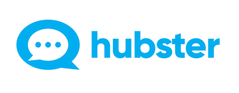

Welcome to Hubster's Documentation Portal
============================================

Hubster is an open-ended *Unified Message Platform as a Service* **(PaaS)** and like all good platforms, we try our best to adhere to industry standards and best practices.

So, what is meant by an **Open-ended** platform? An open-end platform allows a business to extend the platform by enabling the business to bring in their own integration or plugins. 

At Hubster, we provide following ways on how you can extend our platform: 

   | **Integration (BYOI)**: 
   | If you have an integration that Hubster does not currently support or it is unique to your business, you can easily add it to the mix using our direct API. There are no limits on how many customer, agent, bot, or CRM integrations you can add.

   | **Pipeline plugins (BYOP)**
   | Businesses can control the message pipeline by injecting their custom plugins. You can enrich messages, alter, or even control the follow how messages are redirected to any given participant involved in the conversation.

   | **Webhooks**
   | Businesses can add their own webhooks and will only be triggered based on *filter rules*. This is a great way to monitor certain activities that are important to the business. It should be noted that standard Webhooks are based on a one-way communication protocol know as *fire-and-forget*. 

   | **Dynamic Commands**
   | Dynamic commands are a powerful concept allowing agents and/or bots through simple text, instructing Hubster to invoke your backend service to formulate the appropriate response. For example, if your business provides a command to a list a line of clothing specific to the user’s profile, your system can check to see what are the best options and construct a targeted response that is meaningful to the end user.

Our APIs are designed using **REST** principles and most of our payloads are structured using **JSON**. Any exception to this rule will be noted where necessary.

.. note:: Hubster APIs incorporate cross-origin resource sharing (**CORS**) whereby facilitating web applications to freely use our API in an authenticated and secure manner.

| **Please help us make this experience even better**
| If you find any errors or a section is not as clear or lacking details, please don't hesitate to contact us at support@hubster.io

.. toctree::
   :maxdepth: 3
   :hidden:
   :caption: Introduction

   intro/big_picture
   intro/terminology
   intro/support

.. toctree::
   :maxdepth: 3
   :hidden:
   :caption: Quickstarts

   quickstarts/0_overview
   quickstarts/1_client_credentials
   quickstarts/2_interactive_aspnetcore
   quickstarts/3_aspnetcore_and_apis
   quickstarts/4_javascript_client
   quickstarts/5_entityframework
   quickstarts/6_aspnet_identity

.. .. toctree::
..    :maxdepth: 3
..    :hidden:
..    :caption: Topics

.. .. toctree::
..    :maxdepth: 3
..    :hidden:
..    :caption: Endpoints

..    endpoints/discovery
..    endpoints/authorize
..    endpoints/token
..    endpoints/userinfo
..    endpoints/device_authorization
..    endpoints/introspection
..    endpoints/revocation
..    endpoints/endsession

.. .. toctree::
..    :maxdepth: 3
..    :hidden:
..    :caption: Reference
