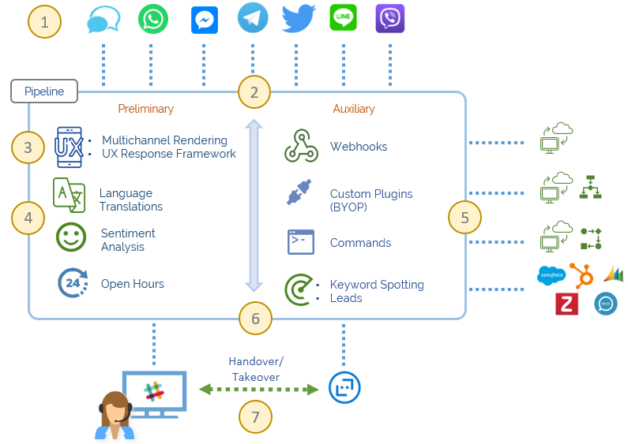
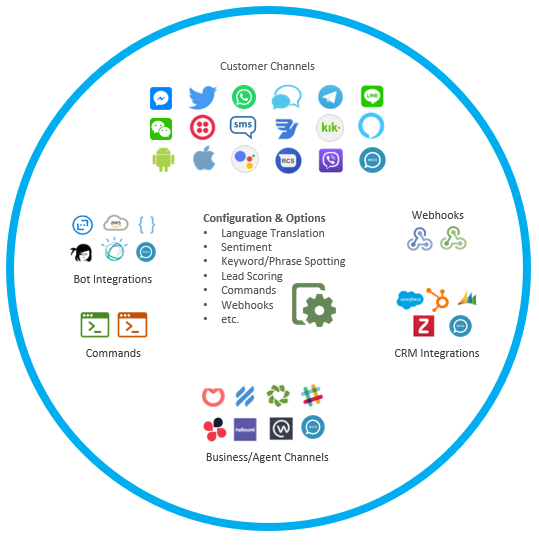

.. _ref_big_picture:

The Big Picture
===============

High Level Architecture
^^^^^^^^^^^^^^^^^^^^^^^

Hubster’s **open-ended** platform was designed for simplicity, yet power enough to allow a business to extend the platform 
to meet their specific needs, on a per :ref:`hub<ref_hub_anatomy>` basis. Being **open-end** provides a business the flexibility to 
enrich the messaging pipeline by injecting their own custom :ref:`integrations and plugins.<ref_BYOI>` 

**Engine**

**Hubster’s Engine workflow and feature annotation:**

#. A customer channel initiates a conversation with the engine
#. The engine reads the channel’s :ref:`hub<ref_hub_anatomy>` configuration and starts the :ref:`pipeline<ref_pipeline>` workflow
#. The pipeline :ref:`reverse engineers<ref_ux_framework>` the channel’s proprietary format and constructs a common Hubster format known as an **activity**
#. Based on the hub’s configuration and channel :ref:`source type<ref_source>`, the pipeline determines the appropriate **preliminary** flow actions required
#. The pipeline then determines the appropriate **auxiliary** flow actions required
#. Once both **preliminary** and **auxiliary** flows have been executed, the pipeline then determines the **active business destination** 
   and reverse engineers the activity to the proprietary format specific to the destination source – agent or bot
#. The agent may initiate a **takeover** from a bot, handles the request, and eventually hands the conversation back to the bot. 
   Conversely, if the bot has difficulty handling a request, the bot can initiate a **handover** and redirect the conversation to the agent.

.. _ref_hub_anatomy:

The Hub Anatomy	
^^^^^^^^^^^^^^^

At Hubster, a **hub** (hence our company name), is the center where all configurations are managed and stored. 
Hubs are used by engine’s :ref:`pipeline<ref_pipeline>` which drives the workflows and what actions are taken. 
A business can create as many hubs they need, each having specific configurations for different aspects of the business. 
For example, a business can create a hub for various lines of business, campaigns or events, and so much more.

=================
Customer Channels
=================

TODO

=================
Business Channels
=================

TODO

* **Agents**        
* **Bots**    
* **Handover rules**

============
CRM Channels
============
.. 	Keyword/Phrase spotting

TODO

========
Webhooks
========

TODO

========
Commands
========
.. 	Quick Response
.. 	Dynamic
.. 	Transfer

TODO

=============
Preliminaries
=============
.. 	Language Translations
.. 	Sentiment Analysis
.. 	Open Hours

TODO

.. _ref_pipeline:

Pipeline
^^^^^^^^

TODO

.. _ref_BYOI:

Bring your own Integration (BYOI)
^^^^^^^^^^^^^^^^^^^^^^^^^^^^^^^^^

TODO

.. _ref_ux_framework:

UX Multi-rendering/Response Framework
^^^^^^^^^^^^^^^^^^^^^^^^^^^^^^^^^^^^^

TODO