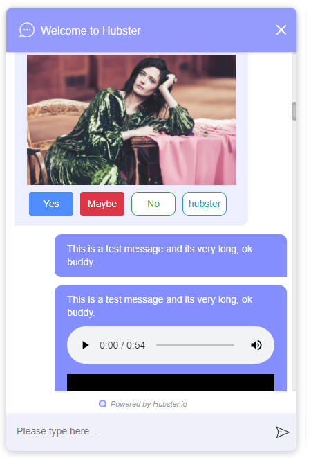
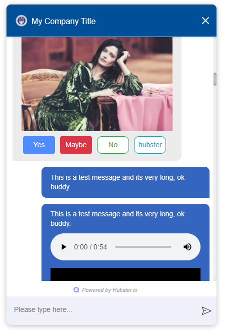

Webchat Configuration
=====================

This section will provide an example on how to embed and configure the Hubster Webchat component 
onto your website.

Embedding the Webchat Component
*******************************

When working with Hubster's Webchat component, you must first embed the component into every page
where you require web-chatting.  

Below is a snippet of the default configure. It should be noted that it's best to 
add the webchat component at the very tail end of the webpage where you plan  to are embed
the webchat component.

.. code-block:: HTML

    <!DOCTYPE html>
    <html  lang="en">
    <head>
        ...
    </head>
    <body>
        ...

        <!-- Webchat script -->
        
        
    </body>    
    </html>

By default, the webchat component will look like this:

**Changing the look-and-feel**

Obviously, you're going to want to change the default to a theme inline with your website.
Below is configuration example of how one would style the component using a blue theme.

.. code-block:: HTML

    <!DOCTYPE html>
    <html  lang="en">
    <head>
        ...
    </head>
    <body>
        ...

        <!-- Webchat script -->
        
        
    </body>    
    </html>

The above configuration yields the following theme.

.. note::
    Before going live, it's best to **style** the webchat component first. This can be a daunting task, 
    however, Hubster makes this easy. 
    
    Hubster provides configuration property called **styling** (see the example above). 
    By default, this property is set to **false**. However, by setting this property to **true**, Hubster will 
    provide a list of all the available webchat widgets for you to style. Most widgets share the same property, 
    meaning that, if you change one style, it may affect one or widgets. 
    
    Hubster provides a wide range of styles that can be change, however, try to avoid changing styles that may affect
    sizes and position.     

Configuration
*************

Webchat Script Versions
***********************

.. list-table::
    :widths: 5 50
    :header-rows: 1

    * - Version
      - Reference
    * - 1.0
      - https://hubsterdevcdn.azureedge.net/pub/scripts/webchat/hubster-webchat-1.0.min.js

